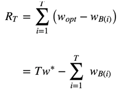
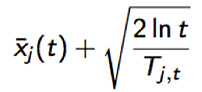

# Bandit算法

参考: [博客](https://blog.csdn.net/dengxing1234/article/details/73188731)

> 基础问题：
一个赌徒，要去摇老虎机，走进赌场一看，一排老虎机，外表一模一样，但是每个老虎机吐钱的概率可不一样，他不知道每个老虎机吐钱的概率分布是什么，那么每次该选择哪个老虎机可以做到最大化收益呢？这就是多臂赌博机问题（Multi-armed bandit problem, K-armed bandit problem, MAB）。

## 1. 推荐系统(解决目标)

> 两个问题

#### a. EE问题(exploit－explore问题)

* exploit：对用户比较确定的兴趣，当然要利用开采(即一般的选取策略)

* explore：光对着用户已知的兴趣使用，用户很快会腻，所以要不断探索用户新的兴趣才行(即对于其他想法的探测)

#### b. 用户冷启动问题

* 面对新用户时，如何能够通过若干次实验，猜出用户的大致兴趣。(数据已知，固定，进行挖掘)

## 2. Brandit描述

#### 建模: 
量化一个核心问题：错误的选择到底有多大的遗憾？能不能遗憾少一些？

* 累计遗憾(regret)

1. 每个臂的收益非0即1，也就是伯努利收益。

2. 每次选择后，计算和最佳的选择差了多少，然后把差距累加起来就是总的遗憾。

3. $w_{B(i)}$是第$i$次试验时被选中臂的期望收益， $w^*$是所有臂中的最佳那个.

4. 这个公式可以用来对比不同Bandit算法的效果：对同样的多臂问题，用不同的Bandit算法试验相同次数，看看谁的regret增长得慢。

## 3. 常用算法

#### 1. Thompson sampling算法

1. 假设每个臂是否产生收益，其背后有一个概率分布，产生收益的概率为p。(贝叶斯学派), 不断地试验，去估计出一个置信度较高的“概率p的概率分布”就能近似解决这个问题了。

2. 估计“概率p的概率分布”:
假设概率p的概率分布符合beta分布，它有两个参数: wins, lose。
每个臂都维护一个beta分布的参数。每次试验后，选中一个臂，摇一下，有收益则该臂的wins增加1，否则该臂的lose增加1。
每次选择臂的方式是：用每个臂现有的beta分布产生一个随机数b，选择所有臂产生的随机数中最大的那个臂去摇

代码实现

    import  numpy as np
    import  pymc
    choice = np.argmax(pymc.rbeta(1 + wins, 1 + trials - wins)) 
    wins[choice] += 1
    trials += 1

#### 2. UCB算法(Upper Confidence Bound(置信区间上界))

1. 初始化：先对每一个臂都试一遍
2. 按照如下公式计算每个臂的分数，然后选择分数最大的臂作为选择：

3. 观察选择结果，更新$t$和$T_{j,t}$。加号前是这个臂到目前的收益均值，后面是均值的标准差，$t$是目前的试验次数，$T_{j,t}$是这个臂被试次数。
这个公式反映一个特点：均值越大，标准差越小，被选中的概率会越来越大，同时哪些被选次数较少的臂也会得到试验机会。

#### 3. Epsilon-Greedy：

以1-epsilon的概率选取当前收益最大的臂,以epsilon的概率随机选取一个臂

#### 4. 朴素Bandit算法

最朴素的Bandit算法就是：先随机试若干次，计算每个臂的平均收益，一直选均值最大那个臂。这个算法是人类在实际中最常采用的，不可否认，它还是比随机乱猜要好。