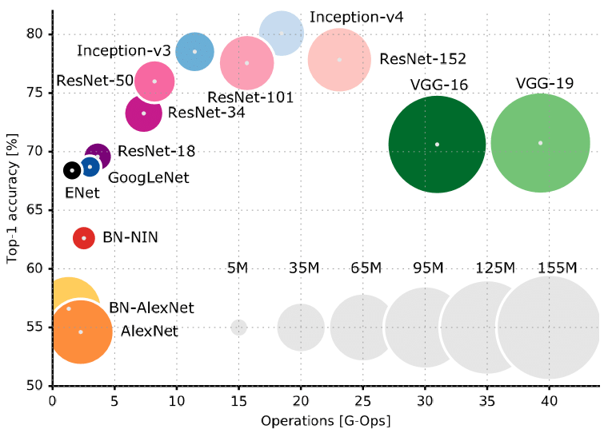

# 卷积神经网络

## 1.原理

利用仿生学, 由**点**局部特征提取转向**一定范围**(多为矩形)的特征提取, 强调图像中特征的相关性与平移旋转等操作之后的不变性, 更为直观的说, 以区间为数据点, 即将原来的点替换为一个数据块, 数据块中有一个张量, 相近数据块中的数据可能会有重叠, 因为具体算法的局限性(一般研究局限于矩阵运算), 故需要将数据块转换为具体数值, 这便是卷积层的参数(当然, 数据块形状也是), 这个参数不一定是正确的或者是最优的, 但是训练使之趋于相对优.

## 2.胡思乱想

卷积神经网络的基本构想与发展方向思考, 一定, 全部都是错的.

1. 省略卷积中"积"的过程
    卷积中的取样导致数据残缺, 可以尝试将该过程省略. 其改良结果是得到一个三维的张量, 并且将参数计算转换为三维甚至更高维. 但是, 数据集的加大与不必要数据的引入, 与算法的基本思想违背.目的是得到.

2. 引入中心加权"积"
    基于旋转等图像操作不改变图像的根本, 将一个中心对称的权值作为初始权值, 同时保持其在参数更新时依然中心对称(作平均数便可). 或许, 可以要求参数自中间向外围减少.
    

3. 忘了想写啥, 想起来再写......

## 3.具体神经网络

#### 1.AlexNet

1. 利用了GPU的运算性能, 加大深度.

2. 引进ReLu激活函数(相对优, 似乎没有对激活函数的评估原则算法)

3. 双层进行, 这可以归于1

4. 引入dropout(还是启发式方法)避免过拟合.

5. 引入LRN平平滑处理

#### 2.VGG

1. 卷积同时通过增加卷积核保持数据的"完整性", 事实上, 直观上来说, 如果将这里的操作极端化, 且不计池化, 可以在已知参数的情况下逆推得到输入数据.

2. 将特征提取完全交给池化层, 全连接层, 分工更为明确

3. 使用更小的卷积核, 达到更佳的效果(很可能是深度的加深弥补了引入小卷积层的缺点, 同时完成二者的互补).

#### 3.GooLeNet

1. 使用1x1卷积核

2. 使用inception

3. 池化之前使用使用feature map

#### 4.ResNet

1. 通过残缺计算大大加大深度, 解决恒等变换难以学习的问题.

2. 极大的网络深度.