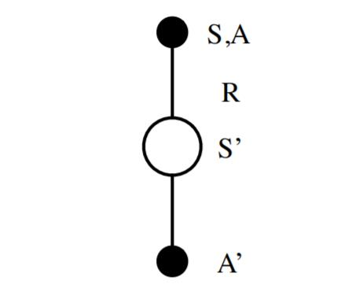

# 强化学习

参考: [博客](https://www.cnblogs.com/pinard/category/1254674.html)

这次真的是笔记
:cry::cry::cry::cry::cry::cry::cry::cry::cry::cry::cry::cry::cry::cry::cry::cry::cry::cry::cry::cry::cry::cry::cry::cry::cry::cry::cry::cry::cry::cry::cry::cry::cry::cry::cry::cry::cry::cry::cry::cry::cry::cry::cry::cry::cry::cry::cry::cry::cry::cry::cry::cry::cry::cry::cry::cry::cry:

:( :( :( :( :( :(

---

# A. 基本要素(关注关联)

> 建模的关键

1. 环境的状态$S$

2. 个体的动作$A$

3. 环境的奖励$R$

4. 个体的策略(policy)$π$,它代表个体采取**动作**的依据:
    $ π( a | s )=P(A_t =a|S_t = s) $

5. 个体在**策略**$π$和**状态**$s$时，采取行动后的**价值**（value).价值要考虑当前的延时奖励和后续的延时奖励: 
    $ v_π(s)=E_π(R_t+1+γR_t+2+γ2R_t+3+...|S_t=s)$

6. 上式γ是第六个模型要素，即奖励衰减因子，在[0，1]之间。
    如果为0，则是贪婪法，即价值只由当前延时奖励决定，如果是1，则所有的后续状态奖励和当前奖励一视同仁。

7. 环境的状态转化模型，可以表示为一个概率模型，即在**状态**$s$下采取**动作**$a$,转到下一个状态$s^′$的概率，表示为$P^a_{ss′}$。

8. 探索率 $ϵ$

---

# B. MDP(Markov Decision Process)

### 1. 马尔可夫假设

改变要素7, 相关局限假设(概率模型只与上一次有关)

> 事实上难点在于理解**假设之前的**同所有之前动作有关

$ P^a_{ss′}=E(S_{t + 1} = s′ | S_t = s,A_t=a) $

### 2. 贝尔曼方程(作用价值函数的迭代推导方式)

#### 预测问题

> 这里坑人的引进了关于动作的价值(这个相关于状态, 动作本身), 注意, 所有推断**局限于要素五**(更准确的, 可以看做目标于要素五), 但是相关于要素二.

> 还是有必要说一下, 动作由决策产生, 动作产生状态又影响下一步决策, 这里引进动作的**主要**目的在于拆解决策(动作也属于决策预料的一部分), 便于推导.

> 相对于以后的推导, 这里可称为第一次迭代(自身迭代)

* 关于决策:
    $$v_{\pi}(s) = \mathbb{E}_{\pi}(G_t|S_t=s ) = \mathbb{E}_{\pi}(R_{t+1} + \gamma R_{t+2} + \gamma^2R_{t+3}+...|S_t=s) = E_π(R_t+1+γv_π(S_t+1)|S_t=s)$$

* 同样关于动作
    $$q_{\pi}(s,a) =\mathbb{E}_{\pi}(R_{t+1} + \gamma q_{\pi}(S_{t+1},A_{t+1}) |S_t=s, A_t=a)$$

### 3. 动作, 状态价值**关系**

#### 预测问题

> 如上所述, 这里是引进动作价值的基础

$$v_{\pi}(s) = \sum\limits_{a \in A} \pi(a|s)q_{\pi}(s,a)$$

$$q_{\pi}(s,a) = R_s^a + \gamma \sum\limits_{s' \in S}P_{ss'}^av_{\pi}(s')$$

> $ R^a_s$为瞬时奖励, 所有推断都做前向做出

> 再做进一步推断得到第二次迭代公式

$$v_{\pi}(s) = \sum\limits_{a \in A} \pi(a|s)(R_s^a + \gamma \sum\limits_{s' \in S}P_{ss'}^av_{\pi}(s'))$$

$$q_{\pi}(s,a) = R_s^a + \gamma \sum\limits_{s' \in S}P_{ss'}^a\sum\limits_{a' \in A} \pi(a'|s')q_{\pi}(s',a')$$

### 4. 最优策略**选取**

#### 控制问题

1. 价值选取
    a. 策略: $$v_{*}(s) = \max_{\pi}v_{\pi}(s)$$
    b. 动作: $$q_{*}(s,a) = \max_{\pi}q_{\pi}(s,a)$$

2. 策略选取

$$\pi_{*}(a|s)= \begin{cases} 1 \ \ \ {if\;a=\arg\max_{a \in A}q_{*}(s,a)}\\ 0 \ \ \  {else} \end{cases}$$
> 此时有

$$v_{*}(s) = \max_{a}q_{*}(s,a)$$

$$q_{*}(s,a) = R_s^a + \gamma \sum\limits_{s' \in S}P_{ss'}^av_{*}(s')$$

> 可得第三次迭代函数

$$v_{*}(s) = \max_a(R_s^a + \gamma \sum\limits_{s' \in S}P_{ss'}^av_{*}(s'))$$
$$q_{*}(s,a) = R_s^a + \gamma \sum\limits_{s' \in S}P_{ss'}^a\max_{a'}q_{*}(s',a')$$

---

# C. 动态规划(Dynamic Programming, DP)

> 求解预测问题

### a. 应用先决

> 动态规划即以局部更新替代整体更新(可以证明, 一定条件下这收敛)

1. 动态规划关键点
    * 问题的最优解可以由若干小问题的最优解构成
    
    * 可以找到子问题状态之间的递推关系，通过较小的子问题状态递推出较大的子问题的状态

2. 强化学习的两个基本问题。

    * 预测，给定强化学习的6个要素：状态集$S$, 动作集$A$, 模型状态转化概率矩阵$P$, 即时奖励$R$，衰减因子$γ$,  给定策略$π$， 求解该**策略**的状态价值函数$v(π)$
    * 控制，也就是求解最优的价值函数和策略。给定强化学习的5个要素：状态集$S$, 动作集$A$, 模型状态转化概率矩阵$P$, 即时奖励$R$，衰减因子$γ$, 求解最优的状态价值函数$v_∗$和最优策略$π_∗$　

3. 关系产生的式子

$$v_{\pi}(s) = \sum\limits_{a \in A} \pi(a|s)(R_s^a + \gamma \sum\limits_{s' \in S}P_{ss'}^av_{\pi}(s'))$$

### b. 具体应用－＞策略评估(Policy Evaluation)

#### 动态规划此式

$$v_{k+1}(s) = \sum\limits_{a \in A} \pi(a|s)(R_s^a + \gamma \sum\limits_{s' \in S}P_{ss'}^av_{k}(s'))$$

### c. 利用结果

> 控制问题

1. 策略迭代求解控制问题
最简单的方法就是贪婪法。在策略迭代过程中，循环进行两部分工作，第一步是使用当前策略$π_∗$评估计算当前策略的最终状态价值$v_∗$，第二步是根据状态价值$v_∗$根据一定的方法（比如贪婪法）更新策略$π_∗$，接着回到第一步，一直迭代下去，最终得到收敛的策略$π_∗$和状态价值$v_∗$。

2. 价值迭代求解控制问题
不等到状态价值收敛才调整策略，而是随着状态价值的迭代及时调整策略, 这样可以大大减少迭代次数。此时状态价值的更新方法也和策略迭代不同。现在的贝尔曼方程迭代式子如下：

$$v_{k+1}(s) = \max_{a \in A}(R_s^a + \gamma \sum\limits_{s' \in S}P_{ss'}^av_{k}(s'))$$

### d. 关于动态规划的细则

1. 同步动态规划算法
即每轮迭代我会计算出所有的状态价值并保存起来，在下一轮中，使用这些保存起来的状态价值来计算新一轮的状态价值。

2. 异步动态规划算法
每一次迭代并不对所有状态的价值进行更新，而是依据一定的原则有选择性的更新部分状态的价值．
常见的异步动态规划算法有三种：
    1. 原位动态规划 (in-place dynamic programming)， 此时我们不会另外保存一份上一轮计算出的状态价值。而是即时计算即时更新。这样可以减少保存的状态价值的数量，节约内存。代价是收敛速度可能稍慢。
    2. 优先级动态规划 (prioritised sweeping)：该算法对每一个状态进行优先级分级，优先级越高的状态其状态价值优先得到更新。通常使用贝尔曼误差来评估状态的优先级，贝尔曼误差即新状态价值与前次计算得到的状态价值差的绝对值。这样可以加快收敛速度，代价是需要维护一个优先级队列。
    3. 实时动态规划 (real-time dynamic programming)：实时动态规划直接使用个体与环境交互产生的实际经历来更新状态价值，对于那些个体实际经历过的状态进行价值更新。这样个体经常访问过的状态将得到较高频次的价值更新，而与个体关系不密切、个体较少访问到的状态其价值得到更新的机会就较少。收敛速度可能稍慢。

# D. 蒙特卡罗法(MC)

### a. 需求产生

有时无法事先得到模型状态转化概率矩阵$P$(要素７)，这时需要不基于模型的强化学习算法(如MC)。

此时的问题是：

* 预测问题:给定强化学习的5个要素：状态集$S$, 动作集$A$, 即时奖励$R$，衰减因子$\gamma$, 策略$\pi$， 求解该策略的状态价值函数$v(\pi)$

* 控制问题。给定强化学习的5个要素：状态集$S$, 动作集$A$, 即时奖励$R$，衰减因子$\gamma$, 探索率$\epsilon$, 求解最优的动作价值函数$q_{*}$和最优策略$\pi_{*}$

### b. 特点

1. 求解方法: 通过采样若干经历完整的状态序列(episode)来估计状态的真实价值。有了很多组这样经历完整的状态序列，我们就可以来近似的估计状态价值，进而求解预测和控制问题。

### c. 求解预测问题(策略评估)

策略$\pi$的完整有T个状态的状态序列：$$S_1,A_1,R_2,S_2,A_2,...S_t,A_t,R_{t+1},...R_T, S_T$$

对于蒙特卡罗法来说，如果要求某一个状态的状态价值，只需要求出所有的完整序列中该状态出现时候的收获再取平均值即可近似求解，也就是：$$G_t =R_{t+1} + \gamma R_{t+2} + \gamma^2R_{t+3}+... \gamma^{T-t-1}R_{T}$$ $$v_{\pi}(s) \approx average(G_t), s.t. S_t=s$$

#### 细分与优化
1. 首次访问(first visit) 和每次访问(every visit) 蒙特卡罗法: 
仅把状态序列中第一次出现该状态时的收获值纳入到收获平均值的计算中或针对一个状态序列中每次出现的该状态，都计算对应的收获值并纳入到收获平均值的计算中。

2. 累进更新平均值（incremental mean):
不保存或每次保存上一轮迭代得到的收获均值与次数，当计算得到当前轮的收获时，即可计算当前轮收获均值和次数。通过下面的公式就很容易理解这个过程：$$\mu_k = \frac{1}{k}\sum\limits_{j=1}^k x_j =\frac{1}{k}(x_k + \sum\limits_{j=1}^{k-1}x_j)= \frac{1}{k}(x_k +(k-1)\mu_{k-1}) = \mu_{k-1} + \frac{1}{k}(x_k -\mu_{k-1})$$

###　d. 求解控制问题

和动态规划比，蒙特卡罗法不同之处体现在三点：一是预测问题策略评估的方法不同。第二是蒙特卡罗法一般是优化最优动作价值函数$q_{*}$，而不是状态价值函数$v_{*}$。三是蒙特卡罗法一般采用$\epsilon-$贪婪法更新。$\epsilon-$贪婪法通过设置一个较小的ϵ值，使用$1-\epsilon$的概率贪婪地选择目前认为是最大行为价值的行为，而用$\epsilon$ 的概率随机的从所有m 个可选行为中选择行为。用公式可以表示为：$$\pi(a|s)= \begin{cases} \epsilon/m + 1- \epsilon\ \ \ \ \ \ {if\; a^{*} = \arg\max_{a \in A}Q(s,a)}\\ \epsilon/m \ \ \ \ \ \ \ \ \ \ \ \ \ \ \ \ \ \ \  {else} \end{cases}$$
在实际求解控制问题时，为了使算法可以收敛，一般$\epsilon$会随着算法的迭代过程逐渐减小，并趋于0。在迭代前期，我们鼓励探索，而在后期，由于我们有了足够的探索量，开始趋于保守，以贪婪为主，使算法可以稳定收敛。

### e. 求解具体控制问题流程

> 在线(on-policy)版本,every-visit,即个状态序列中每次出现的相同状态.

输入：状态集$S$, 动作集$A$, 即时奖励$R$，衰减因子$\gamma$, 探索率$\epsilon$

输出：最优的动作价值函数$q_{*}$和最优策略$\pi_{*}$

1. 初始化
所有的动作价值$Q(s,a) = 0$， 状态次数$N(s,a) = 0$，采样次数$k=0$，随机初始化一个策略$\pi$
2. k=k+1, 基于策略$\pi$进行第k次蒙特卡罗采样，得到一个完整的状态序列: $$S_1,A_1,R_2,S_2,A_2,...S_t,A_t,R_{t+1},...R_T, S_T$$
3. 对于该状态序列里出现的每一状态行为对$(S_t, A_t)$，计算其收获$G_t$, 更新其计数$N(s,a)$和行为价值函数$Q(s,a)$：$$G_t =R_{t+1} + \gamma R_{t+2} + \gamma^2R_{t+3}+... \gamma^{T-t-1}R_{T}$$$$N(S_t, A_t) = N(S_t, A_t) +1 $$$$Q(S_t, A_t) =;Q(S_t, A_t) + \frac{1}{N(S_t, A_t)}(G_t - Q(S_t, A_t))$$
4. 基于新计算出的动作价值，更新当前的$\epsilon-$贪婪策略：$$\epsilon = \frac{1}{k}$$$$\pi(a|s)= \begin{cases} \epsilon/m + 1- \epsilon\ \ \ \ \   \ \ {if\; a^{*} = \arg\max_{a \in A}Q(s,a)}\\ \epsilon/m \ \ \ \ \ \ \ \ \ \ \ \ \ \ \ \ \ \ \ \ {else} \end{cases}$$
5. 如果所有的$Q(s,a)$收敛，则对应的所有$Q(s,a)$即为最优的动作价值函数$q_{*}$。对应的策略$\pi(a|s)$即为最优策略$\pi_{*}$。否则转到第二步.

# E. 时序差分(Temporal-Difference, TD)

### a. 总述：

1. 目标：解决不知环境的状态转化概率模型，没有完整的状态序列的状况

2. 原理：
结合贝尔曼方程(可以推广到更多步)：$$v_{\pi}(s) = \mathbb{E}_{\pi}(R_{t+1} + \gamma v_{\pi}(S_{t+1}) |S_t=s)$$
和蒙特卡罗法中计算状态收获的方法：$$G_t =R_{t+1} + \gamma R_{t+2} + \gamma^2R_{t+3}+...\gamma^{T-t-1}R_{T}$$用$R_{t+1} + \gamma v(S_{t+1})$来近似的代替收获$G_t$, 一般我们把$R_{t+1} + \gamma V(S_{t+1})$称为TD目标值。$R_{t+1} + \gamma V(S_{t+1}) -V(S_t)$称为TD误差,将用TD目标值近似代替收获$G(t)$的过程称为引导(bootstrapping)。这样我们只需要两个连续的状态与对应的奖励，就可以尝试求解强化学习问题了。(还是使用了MDP假设)．

### b. 求解预测问题

1. 收获

$$G(t) = R_{t+1} + \gamma V(S_{t+1})$$

2. 时序差分没有完整的序列，也就没有对应的次数$N(S_t)$,一般就用一个[0,1]的系数$\alpha$代替。这样时序差分的**价值函数迭代**式子是：$$V(S_t) =V(S_t) + \alpha(G_t - V(S_t))$$
$$Q(S_t, A_t) =Q(S_t, A_t) +\alpha(G_t -Q(S_t, A_t))$$

### c. TD(λ)

n步时序差分选择多少步数作为一个较优的计算参数是需要尝试的超参数调优问题。为了能在不增加计算复杂度的情况下综合考虑所有步数的预测，可以引入了一个新[0,1]的参数$\lambda$，定义$\lambda-$收获是n从1到$\infty$所有步的收获乘以权重的和。每一步的权重是$(1-\lambda)\lambda^{n-1}$，这样$\lambda-$收获的计算公式表示为：$$G_t^{\lambda} = (1-\lambda)\sum\limits_{n=1}^{\infty}\lambda^{n-1}G_t^{(n)}$$
$TD(\lambda)$的价值函数的迭代公式：$$V(S_t) = V(S_t) + \alpha(G_t^{\lambda} - V(S_t) )$$
$$Q(S_t, A_t) =Q(S_t, A_t) +\alpha(G_t^{\lambda}- Q(S_t, A_t))$$

从前向来看$TD(\lambda)$，一个状态的价值$V(S_t)$由$G_t$得到，而$G_t$又间接由所有后续状态价值计算得到，因此可以认为更新一个状态的价值需要知道所有后续状态的价值。也就是说，必须要经历完整的状态序列获得包括终止状态的每一个状态的即时奖励才能更新当前状态的价值。这和蒙特卡罗法的要求一样，因此$TD(\lambda)$有着和蒙特卡罗法一样的劣势。当$\lambda =0 $ 时,就是第二节讲到的普通的时序差分法，当$\lambda =1 $ 时,就是蒙特卡罗法。
从反向来看$TD(\lambda)$，它可以分析我们状态对后续状态的影响。比如老鼠在依次连续接受了3 次响铃和1 次亮灯信号后遭到了电击，那么在分析遭电击的原因时，到底是响铃的因素较重要还是亮灯的因素更重要呢？如果把老鼠遭到电击的原因认为是之前接受了较多次数的响铃，则称这种归因为频率启发(frequency heuristic) 式；而把电击归因于最近少数几次状态的影响，则称为就近启发(recency heuristic) 式。
如果给每一个状态引入一个数值：效用(eligibility, E) 来表示该状态对后续状态的影响，就可以同时利用到上述两个启发。而所有状态的效用值总称为效用迹(eligibility traces,ES)。定义为：$$E_0(s) = 0$$
$$E_t(s) = \gamma\lambda E_{t-1}(s) +1(S_t=s) = \begin{cases} 0 \ \ \ \ \ \ \ \ \ \ \ \ \ \ \ \ {t< k}\\ (\gamma\lambda)^{t-k} \ \ \ \ \ {t\geq k} \end{cases}, \;\;s.t.\; \lambda,\gamma \in [0,1], s\; is\; visited \;once\;at\; time\; k$$
此时$TD(\lambda)$的价值函数更新式子可以表示为：$$\delta_t = R_{t+1} + \gamma v(S_{t+1}) -V(S_t)$$
$$V(S_t) =V(S_t) + \alpha\delta_tE_t(s)$$
前向的式子和反向的式子是等价的。

# F. 时序差分在线控制算法SARSA

### a. 概述

由S,A,R,S,A几个字母组成的。S,A,R分别代表状态（State），动作(Action),奖励(Reward)。

在迭代的时候，我们首先基于$\epsilon-$贪婪法在当前状态$S$选择一个动作$A$，这样系统会转到一个新的状态$S'$, 同时给我们一个即时奖励$R$, 在新的状态$S'$，我们会基于$\epsilon-$贪婪法在状态$S‘’$选择一个动作$A'$，但是注意这时候我们并不执行这个动作$A'$，只是用来更新的我们的价值函数，价值函数的更新公式是：$$Q(S,A) = Q(S,A) + \alpha(R+\gamma Q(S',A') - Q(S,A))$$
其中，$\gamma$是衰减因子，$\alpha$是迭代步长。这里和蒙特卡罗法求解在线控制问题的迭代公式的区别主要是，收获$G_t$的表达式不同，对于时序差分，收获$G_t$的表达式是$R+\gamma Q(S',A')$。除了收获 $G_t$的表达式不同，SARSA算法和蒙特卡罗在线控制算法基本类似。

### b. SARSA算法流程
算法输入：迭代轮数$T$，状态集$S$, 动作集$A$, 步长$\alpha$，衰减因子$\gamma$, 探索率$\epsilon$

输出：所有的状态和动作对应的价值$Q$

1. 随机初始化所有的状态和动作对应的价值$Q$. 对于终止状态其$Q$值初始化为0.

2. for i from 1 to T，迭代。
    a) 初始化S为当前状态序列的第一个状态。设置$A$为$\epsilon-$贪婪法在当前状态$S$选择的动作。
    b) 在状态$S$执行当前动作$A$,得到新状态$S'$和奖励$R$
    c) 用$\epsilon-$贪婪法在状态$S'$选择新的动作$A'$
    d) 更新价值函数$Q(S,A)$:$$Q(S,A) = Q(S,A) + \alpha(R+\gamma Q(S',A') - Q(S,A))$$
    e) $S=S', A=A'$
    f) 如果$S'$是终止状态，当前轮迭代完毕，否则转到步骤b)
    这里有一个要注意的是，步长$\alpha$一般需要随着迭代的进行逐渐变小，这样才能保证动作价值函数$Q$可以收敛。当$Q$收敛时，我们的策略$\epsilon-$贪婪法也就收敛了。

### c. SARSA($\lambda$)
$TD(\lambda)$有前向和后向两种价值函数迭代方式，当然它们是等价的。在控制问题的求解时，基于反向认识的 $SARSA(\lambda)$算法将可以有效地在线学习，数据学习完即可丢弃。因此$SARSA(\lambda)$算法默认都是基于反向来进行价值函数迭代。
在上一篇我们讲到了$TD(\lambda)$状态价值函数的反向迭代，即：$$\delta_t = R_{t+1} + \gamma V(S_{t+1}) -V(S_t)$$$$V(S_t) = V(S_t) + \alpha\delta_tE_t(S)$$
对应的动作价值函数的迭代公式可以找样写出，即：$$\delta_t = R_{t+1} + \gamma Q(S_{t+1},A_{t+1}) -Q(S_t, A_t)$$
$$Q(S_t, A_t) =Q(S_t, A_t) + \alpha\delta_tE_t(S,A)$$
除了状态价值函数$Q(S,A)$的更新方式，多步参数$\lambda$以及反向认识引入的效用迹$E(S,A)$，其余算法思想和SARSA类似。这里我们总结下$SARSA(\lambda)$的
**算法流程**。

算法输入：迭代轮数$T$，状态集$S$, 动作集$A$, 步长$\alpha$，衰减因子$\gamma$, 探索率$\epsilon$,多步参数$\lambda$

输出：所有的状态和动作对应的价值$Q$

1. 随机初始化所有的状态和动作对应的价值$Q$. 对于终止状态其$Q$值初始化为0.
2. for i from 1 to T，进行迭代。
    a) 初始化所有状态动作的效用迹$E$为0，初始化S为当前状态序列的第一个状态。设置$A$为$\epsilon-$贪婪法在当前状态$S$选择的动作。
    b) 在状态$S$执行当前动作$A$,得到新状态$S'$和奖励$R$
    c) 用$\epsilon-$贪婪法在状态$S'$选择新的动作$A'$
    d) 更新效用迹函数$E(S,A) $和TD误差$\delta$: $$E(S,A) = E(S,A)+1$$$$\delta= R_{t+1} + \gamma Q(S_{t+1},A_{t+1}) -Q(S_t, A_t)$$
    e) 对当前序列所有出现的状态s和对应动作a, 更新价值函数$Q(s,a)$和效用迹函数$E(s,a) $:$$Q(s,a) = Q(s,a) + \alpha\delta E(s,a)$$$$E(s,a) = \gamma\lambda E(s,a)$$
    f) $S=S', A=A'$
    g) 如果$S'$是终止状态，当前轮迭代完毕，否则转到步骤b)
    对于步长$\alpha$，和SARSA一样，一般也需要随着迭代的进行逐渐变小才能保证动作价值函数$Q$收敛。
### d. SARSA小结
SARSA算法和动态规划法比起来，不需要环境的状态转换模型，和蒙特卡罗法比起来，不需要完整的状态序列，因此比较灵活。在传统的强化学习方法中使用比较广泛。
但是SARSA算法也有一个传统强化学习方法共有的问题，就是无法求解太复杂的问题。在 SARSA 算法中，$Q(S,A)$ 的值使用一张大表来存储的，如果我们的状态和动作都达到百万乃至千万级，需要在内存里保存的这张大表会超级大，甚至溢出，因此不是很适合解决规模很大的问题。当然，对于不是特别复杂的问题，使用SARSA还是很不错的一种强化学习问题求解方法。

# G. 时序差分离线控制算法Q-Learning

